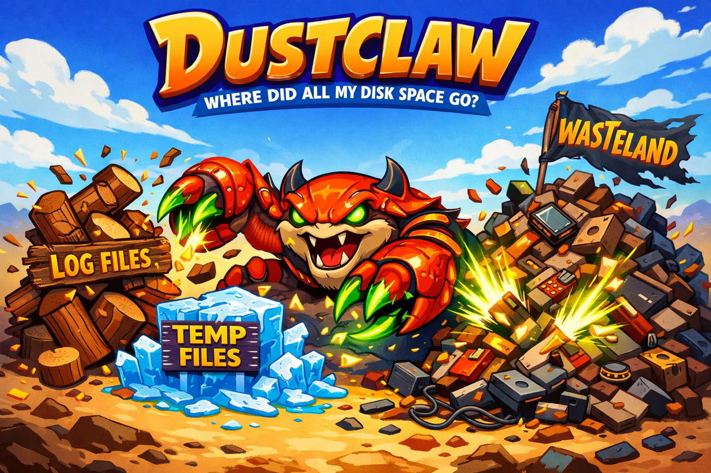

# Dustclaw 🦀

Find out what is eating your disk space and where the bloat is hiding.

<p align="center">
  
</p>

`dustclaw` answers the question every developer asks once a month: where did all my disk space go?

It scans your disk, shows you what is big, and knows where macOS and dev tools hide gigabytes of caches, build artifacts, and forgotten dependencies. Plain table output by default. Use `--json` for scripts and automation.

## Why Dustclaw Exists

There are excellent disk space tools out there — [dust](https://github.com/bootandy/dust) and [dua-cli](https://github.com/Byron/dua-cli) are blazing fast Rust scanners, [duf](https://github.com/muesli/duf) is a beautiful Go replacement for `df`, and [npkill](https://github.com/voidcosmos/npkill) is great for cleaning up `node_modules`.

Dustclaw takes a different angle. It focuses on dev-aware scanning and lives in the npm ecosystem:

- **Dev-aware scanning** — knows about Xcode DerivedData, Docker data, Homebrew caches, Playwright browsers, Gradle, Maven, Cargo, and dozens of other known space wasters
- **Cache breakdown** — shows every application cache individually instead of one mystery lump
- **npm-installable** — `npx dustclaw` and you are running

## 10-Second Proof

```bash
npx dustclaw wasteland
```

```text
  Wasteland Report

  Known space wasters:

┌────────────────────────────────┬───────────┬──────────────────────────────────────────────────┐
│ Name                           │ Size      │ Path                                             │
┼────────────────────────────────┼───────────┼──────────────────────────────────────────────────┼
│ Docker Desktop                 │ 460.5 GB  │ ~/Library/Containers/com.docker.docker/Data       │
│ npm Cache                      │ 14.1 GB   │ ~/.npm/_cacache                                  │
│ Cache: Cursor Updates          │ 7.8 GB    │ ~/Library/Caches/com.todesktop.230313mzl4w4u92   │
│ Android Emulators              │ 7.8 GB    │ ~/.android/avd                                   │
│ Cache: Google/Chrome           │ 3.9 GB    │ ~/Library/Caches/Google                          │
│ Homebrew Cache                 │ 3.4 GB    │ ~/Library/Caches/Homebrew                        │
│ Gradle Cache                   │ 2.5 GB    │ ~/.gradle/caches                                 │
│ pnpm Store                     │ 2.4 GB    │ ~/Library/pnpm/store                             │
│ Cache: Playwright Browsers     │ 2.2 GB    │ ~/Library/Caches/ms-playwright                   │
│ Cache: Spotify                 │ 1.3 GB    │ ~/Library/Caches/com.spotify.client               │
└────────────────────────────────┴───────────┴──────────────────────────────────────────────────┘

  Total reclaimable: 515.1 GB
```

That is real output from a real machine.

## Commands

| Command | What it does |
|---------|-------------|
| `dustclaw` | Quick overview — disk usage, free space, top 10 biggest items |
| `dustclaw scan [path]` | Deep scan — ranked list of largest files and folders |
| `dustclaw wasteland` | Finds known space wasters — caches, build artifacts, Trash, Docker |

## Requirements

- Node.js 18+
- macOS or Linux

## Install

```bash
npm install -g dustclaw
```

Or run without installing:

```bash
npx dustclaw
```

## Usage

### Overview (default)

```bash
dustclaw
dustclaw -n 20              # show top 20 instead of 10
dustclaw -p ~/Projects      # scan a specific path
```

### Scan

```bash
dustclaw scan ~/Projects
dustclaw scan -n 30 -d 5          # top 30, depth 5
dustclaw scan --older-than 30d    # only items older than 30 days
dustclaw scan --files-only        # only files, no directories
dustclaw scan --dirs-only         # only directories, no files
```

### Wasteland

Scans known locations where dev tools and macOS pile up gigabytes:

- Xcode DerivedData, archives, device support
- Docker Desktop data
- Homebrew, npm, pnpm, Yarn, pip caches
- Gradle, Maven, Cargo caches
- Android emulators, iOS simulators
- Playwright and Cypress browsers
- Every application cache in `~/Library/Caches`, broken down individually
- Trash

```bash
dustclaw wasteland
dustclaw wasteland --node-modules ~/Projects    # also find all node_modules
```

## Flags

| Flag | Available on | What it does |
|------|-------------|-------------|
| `--json` | all commands | Output as JSON for scripting |
| `--older-than <age>` | scan | Filter by age — `30d`, `6m`, `1y` |
| `-n, --top <count>` | overview, scan | Number of items to show |
| `-d, --depth <depth>` | scan | Max directory depth |
| `--files-only` | scan | Show only files |
| `--dirs-only` | scan | Show only directories |
| `--node-modules <path>` | wasteland | Also search for node_modules recursively |

## Standing on the Shoulders of Giants

Dustclaw exists because of the excellent work done by these projects:

- [dust](https://github.com/bootandy/dust) — fast, intuitive disk usage viewer written in Rust. If raw scanning speed is what you need, dust is hard to beat.
- [duf](https://github.com/muesli/duf) — a modern `df` replacement written in Go. Beautiful output and JSON support.
- [dua-cli](https://github.com/Byron/dua-cli) — parallel disk usage analyzer with interactive deletion, written in Rust. Maxes out your SSD.
- [npkill](https://github.com/voidcosmos/npkill) — finds and deletes `node_modules` folders. Simple, effective, widely used.
- [space-hogs](https://github.com/dylang/space-hogs) — discovers surprisingly large directories from the command line.

These tools do what they do very well. Dustclaw does not try to outperform them on raw speed. Instead, it brings dev-aware scanning and cache breakdown to the npm ecosystem — things those tools were not built to do.

## Development

```bash
git clone https://github.com/psandis/dustclaw.git
cd dustclaw
pnpm install
pnpm build
pnpm test
pnpm lint
```

## Roadmap

- **watch** — track disk usage over time, spot trends before you run out of space
- **duplicates** — find duplicate large files by hash
- **clean** — interactive cleanup with dry-run safety

## Related

- 🦀 [Feedclaw](https://github.com/psandis/feedclaw) — RSS/Atom feed reader and AI digest CLI
- 🦀 [Driftclaw](https://github.com/psandis/driftclaw) — Deployment drift detection across environments

## License

See [MIT](./LICENSE)
